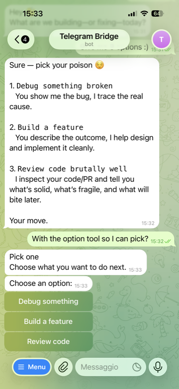
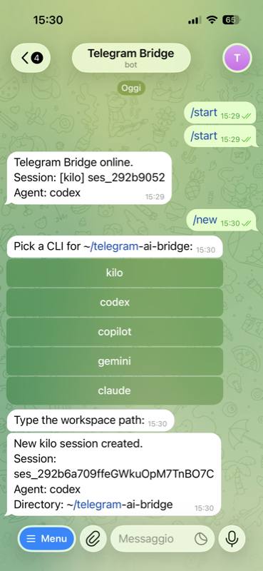

# Telegram Bridge

Run your local AI coding CLI from Telegram on your phone. The bridge forwards messages to [Claude Code](https://github.com/anthropics/claude-code), [Codex](https://github.com/openai/codex), [GitHub Copilot](https://github.com/features/copilot), [Gemini CLI](https://github.com/google-gemini/gemini-cli), [Kilo](https://kilocode.ai), or [LM Studio](https://lmstudio.ai) running on your machine and sends replies back.

Same sessions, same config, same MCP servers. Nothing to rebuild.

> **LM Studio** runs 100% local — no cloud, no API keys, no data leaves your machine.
> Optional side effect: turns your MacBook into a space heater.

<p align="center">
  
  &nbsp;&nbsp;
  
</p>

<p align="center"><small><b>Left:</b> when the AI calls <code>mcp_question</code>, the bridge surfaces the choices as a native Telegram inline keyboard — tap to answer. <b>Right:</b> <code>/new</code> picks a CLI, binds a workspace, and you're chatting in three taps.</small></p>

## About this project

I built this for myself. I wanted to keep working with my AI coding CLIs from my phone without giving up the local-first, provider-agnostic setup I trust. It's been my daily driver for months and it does what I need it to do. I'm publishing it in case it's useful to someone else.

This is a personal project. I use it every day, so I'll keep it alive — but there's no SLA, no roadmap, no support commitment. Issues and PRs are welcome and I'll get to them when I can. If something only breaks for your specific setup and I can't easily reproduce it, I probably won't chase it down. If that's a dealbreaker, fork it freely — that's what MIT is for.

MIT, gift.

## What it is / What it isn't

| What it is | What it isn't |
|------------|---------------|
| A transport layer between Telegram and your existing CLIs | An AI agent or hosted service |
| Single-user, self-hosted, trusted-machine | A multi-tenant platform |
| Provider-agnostic — works with any supported CLI | Locked to one provider |
| Stateless — all intelligence lives in the CLI backends | Another LLM wrapper |
| Privacy-first option via LM Studio — 100% local, zero cloud, BYOK | Requiring an API key or subscription |

## Why it exists

AI coding CLIs are powerful but desktop-only. When you're away from your machine you lose access to running sessions, project context, and tool integrations you've already configured.

This bridge gives you mobile access to all your coding CLIs through a single Telegram interface — no lock-in, no hosted service, no rebuild. If you switch providers, your workflow stays the same.

## Quickstart

### Prerequisites

- Node.js 22+
- At least one supported CLI installed and authenticated locally
- A Telegram bot token ([create one with BotFather](https://t.me/BotFather))

Make sure your CLI works locally first (`codex --help`, `claude --version`, etc.) before setting up the bridge.

### 1. Clone and install

```bash
git clone https://github.com/legate-dev/telegram-ai-bridge.git
cd telegram-ai-bridge
npm install
```

### 2. Configure

```bash
cp .env.example .env
```

Edit `.env` with your bot token. See `.env.example` for all available options.

### 3. Start the bridge

```bash
npm start
```

Most backends (Claude, Codex, Copilot, Gemini) are spawned per message — no daemon needed. Kilo is auto-spawned by the bridge on startup on port 4097 — no manual `kilo serve` required.

### 4. First interaction

If `TELEGRAM_ALLOWED_USER_ID` is blank, the bot starts in **bootstrap mode** and replies with your Telegram user ID on first message. Copy that ID into `.env`, restart, then:

```
/new codex ~/my-project     → create a Codex session on your repo
fix the failing test         → sends prompt to Codex, reply comes back
/new claude ~/other-repo     → switch to Claude Code on a different repo
/status                      → check current session
```

The bridge auto-detects which CLIs you have installed and only shows those in the picker.

## Supported backends

| CLI | Mode | Status |
|-----|------|--------|
| **Claude Code** | `claude --output-format stream-json` (AsyncGenerator; interactive permission prompts opt-in) | ✅ Full support |
| **Codex** | `codex exec --json` | ✅ Full support |
| **Copilot** | `copilot -p --output-format json` | ✅ Full support |
| **Gemini** | `gemini --output-format stream-json` (AsyncGenerator; `-y` auto-approve) | ✅ Full support |
| **Kilo** | HTTP API (`kilo serve`, bridge-managed) | ✅ Full support |
| **LM Studio** | `POST /v1/chat/completions` stream (AsyncGenerator; local-only, BYOK) | ✅ Full support |
| Qwen | Session scanning only | Browse & resume |

The bridge parses each CLI's JSON/JSONL output. When a CLI ships a breaking format change, the parser may need updating — see [CONTRIBUTING.md](CONTRIBUTING.md#reporting-parser-breakage) for how to report and fix these.

## Bot commands

| Command | Description |
|---------|-------------|
| `/start` | Show bridge status |
| `/new [cli] [path]` | Create a new session (workspace picker if no args) |
| `/sessions` | Browse recent sessions from all CLIs |
| `/clis` | List discovered CLIs and session counts |
| `/rename <name>` | Rename current session |
| `/status` | Show current session details |
| `/abort` | Abort current session |
| `/detach` | Unbind current session |
| `/agents` | List available agents (Kilo only) |
| `/agent <name>` | Set preferred agent (Kilo only) |
| `/models` | List available models (Claude/Codex) |
| `/model <name>` | Set model for current session (Claude/Codex) |
| `/cleanup` | Preview or delete old bridge-created Kilo sessions |

## Proactive push (optional)

The bridge itself is request-driven: nothing happens until you send a Telegram message. If you want **proactive push notifications** — cron-triggered morning briefings, monitoring alerts, CI notifications, webhook bridges — the recommended pattern is a **separate Telegram bot** dedicated purely to outbound notifications. The bridge is not extended, it stays single-purpose.

### Why a second bot

Keeping the bridge request-driven and pushing notifications through a dedicated bot gives you:

- **Zero coupling** with the bridge — push keeps working even when the bridge is stopped or restarting
- **Static notifications** that don't need an AI at all (build failed, disk full, GitHub webhook) — just one curl call
- **AI-filtered notifications** — a short shell script that calls your CLI (`claude -p`, `codex exec`, etc.) and only pushes if the output is non-empty
- **Category separation** — point the bot at a private Telegram channel and get per-category mute, dedicated scroll history, and clean forwarding
- **Universal auth** — the Telegram bot token is already battle-tested, no custom shared-secret endpoint to maintain

See [`DECISION_LOG.md`](DECISION_LOG.md) for the full rationale.

### Setup

1. **Create a second bot** via [@BotFather](https://t.me/BotFather) on Telegram. Use `/newbot`, pick a name and username (e.g. `YourNamePushBot`). Save the token it returns — this is `TG_PUSH_BOT_TOKEN`.
2. **(Optional but recommended)** Create a private Telegram channel for your notifications:
   - In Telegram: New Channel → private → name it (e.g. `My Notifications`)
   - Add your push bot as an administrator with "Post Messages" permission
   - Get the channel's numeric ID by forwarding one of its messages to [@userinfobot](https://t.me/userinfobot) — it'll be negative (e.g. `-1001234567890`). This is `TG_PUSH_CHAT_ID`.
   - If you prefer a direct bot chat instead, use `/start` on the bot and use your own user ID as `TG_PUSH_CHAT_ID` (positive number).
3. **Store the credentials** in your environment or a `.env` file sourced by your cron:
   ```bash
   export TG_PUSH_BOT_TOKEN="1234567890:AABB..."
   export TG_PUSH_CHAT_ID="-1001234567890"   # or "123456789" for direct chat
   ```

### Pattern 1 — Static push (no AI)

From any script, CI pipeline, webhook handler, or command line:

```bash
curl -sS -X POST "https://api.telegram.org/bot${TG_PUSH_BOT_TOKEN}/sendMessage" \
  --data-urlencode "chat_id=${TG_PUSH_CHAT_ID}" \
  --data-urlencode "text=Build #1234 failed on main — check CI"
```

That's the whole integration. No bridge, no CLI, no session. See [`scripts/examples/static-push.sh.example`](scripts/examples/static-push.sh.example) for a reusable wrapper.

### Pattern 2 — AI-filtered push

Use a CLI like Claude/Codex to reason about something and push the result to Telegram only when worth it. The AI decides whether to notify you:

```bash
ANALYSIS=$(claude -p "Check last 200 lines of /var/log/prod.log. \
If there are critical errors, summarize in 3 bullet points. \
If logs look normal, respond with nothing." --output-format json | jq -r '.result // empty')

if [ -n "$ANALYSIS" ]; then
  curl -sS -X POST "https://api.telegram.org/bot${TG_PUSH_BOT_TOKEN}/sendMessage" \
    --data-urlencode "chat_id=${TG_PUSH_CHAT_ID}" \
    --data-urlencode "text=🚨 ${ANALYSIS}"
fi
```

Schedule via cron, launchd, or systemd timers. See [`scripts/examples/notify-on-error.sh.example`](scripts/examples/notify-on-error.sh.example) for the full version, and [`scripts/examples/morning-briefing.sh.example`](scripts/examples/morning-briefing.sh.example) for an "AI-generated morning briefing at 08:00" variant.

### Pattern 3 — Webhook bridge (GitHub, n8n, Stripe, etc.)

Point any webhook at a small receiver that reformats the payload and pushes it via the bot. The receiver can be a 10-line Node/Python script, an n8n workflow, or a Cloud Function — whatever fits your stack. The same `sendMessage` endpoint works.

### A note on markdown

The examples above send plain text. If you want Telegram MarkdownV2 formatting (bold, code blocks, etc.), add `parse_mode=MarkdownV2` to the curl call and escape the text properly. For most notifications plain text is simpler and always works — reach for MarkdownV2 only when you actually need formatting.

## How it works

```text
Telegram (phone) → grammY bot → CLI backend → AI response → Telegram
```

At startup the bridge scans local CLI session directories into a SQLite database. From Telegram you can browse discovered sessions, pick one, and continue the same conversation — or create new sessions on any workspace.

For Kilo, turns are submitted asynchronously with status polling, supporting long-running operations (tool calls, multi-step reasoning, subagent delegation) up to 30 minutes without dropping the response.

## Security model

The bridge is designed for **single-user, trusted-machine** environments. The trust boundary is your **Telegram bot token**.

### What protects you

- Only the Telegram user ID listed in `TELEGRAM_ALLOWED_USER_ID` can interact with the bridge — every message from any other user is rejected upfront
- Bridge-owned secrets (`TELEGRAM_BOT_TOKEN`, `TELEGRAM_ALLOWED_USER_ID`, `KILO_SERVER_USERNAME`, `KILO_SERVER_PASSWORD`) are stripped from the environment passed to CLI subprocesses
- All error messages are redacted before reaching Telegram (bot tokens, basic auth headers, common API key patterns)
- No hosted control plane — your repos, config, and auth stay on your machine

### What you must understand

The bridge runs CLI backends with **tool approval disabled** for unattended operation (`--permission-mode bypassPermissions`, `--allow-all-tools`, etc.). This is the trade-off that makes the bridge useful from a phone: long Kilo sessions and multi-step Codex/Claude/Copilot turns can run without prompts blocking them.

The consequence: **anyone holding your `TELEGRAM_BOT_TOKEN` has arbitrary code execution on your host** through the CLIs' shell tool. They can read your filesystem, exfiltrate credentials in `~/.codex`, `~/.claude`, `~/.aws`, etc., or run any command your user can run.

**Treat the bot token like an SSH private key.** Never commit it. Never paste it in screenshots. Never log it. If you suspect it leaked, revoke the bot via [@BotFather](https://t.me/BotFather) immediately and create a new one.

**One token, one machine.** Do not run the same bot token on multiple hosts or bridge instances simultaneously. With multiple `getUpdates` long-pollers, the instances will race for updates: a given update may be handled by either instance, and independent `offset` management can also cause duplicates or missed updates. The result is conversations splitting unpredictably between machines and sessions breaking mid-conversation. If you want the bridge on more than one host, create a separate bot per machine via BotFather.

The CLI provider API keys (`OPENAI_API_KEY`, `ANTHROPIC_API_KEY`, `GITHUB_TOKEN`, etc.) are managed by their respective CLIs (typically in `~/.codex/auth.json`, `~/.claude/credentials.json`, etc.), not by the bridge. The bridge does not read, store, or filter them — they live where their owning CLI puts them. Filtering them out of the bridge's child-process environment would not protect them, because a compromised CLI session can read any file the user can read.

### Hardening roadmap

Three opt-in tiers are planned post-v0.3.0 to reduce the blast radius of a leaked bot token. Each tier is backward-compatible with the previous and respects the project's UX core (never force the user out of Telegram for a normal message):

1. **Time-Bounded Operation Mode (TBOM)** — bridge operates only within a time window that the user must renew from the local terminal; expired bridge refuses messages until renewed (`v0.4.x`)
2. **Passphrase 2FA via Telegram** — when TBOM expires, the bridge can be unlocked from Telegram with a knowledge factor (passphrase, never stored in plaintext) (`v0.5.x`)
3. **WebAuthn / device-signed renewal (PWA)** — TBOM renewal via Secure Enclave / Keystore signature, hardware-backed and phishing-resistant (`v0.6.x`)

See [`DECISION_LOG.md`](DECISION_LOG.md) for the full design and rationale of each tier, and [`SECURITY.md`](SECURITY.md) for the complete threat model. See [ARCHITECTURE.md](ARCHITECTURE.md) for the implementation-level security details.

## Docs

| File | Purpose |
|------|---------|
| [`ARCHITECTURE.md`](ARCHITECTURE.md) | System design, components, security model |
| [`API_CONTRACT.md`](API_CONTRACT.md) | Backend interface, commands, config contract |
| [`OPERATIONS.md`](OPERATIONS.md) | Runtime invariants, logging, active debt |
| [`IMPLEMENTATION.md`](IMPLEMENTATION.md) | Phases, steps, progress tracking |
| [`DECISION_LOG.md`](DECISION_LOG.md) | Architecture decisions with rationale |
| [`CHANGELOG.md`](CHANGELOG.md) | Release notes per version |
| [`CONTRIBUTING.md`](CONTRIBUTING.md) | How to contribute |

## Configuration

All configuration is via environment variables. Copy `.env.example` to `.env` and adjust:

| Variable | Required | Default | Description |
|----------|----------|---------|-------------|
| `TELEGRAM_BOT_TOKEN` | yes | — | Bot token from BotFather |
| `TELEGRAM_ALLOWED_USER_ID` | no | — | Restrict to single user (bootstrap mode if blank) |
| `BRIDGE_DEFAULT_DIRECTORY` | no | `.` | Default workspace for `/new` |
| `BRIDGE_DB_PATH` | no | `./sessions.db` | Path to the bridge SQLite database |
| `KILO_SERVE_PORT` | no | `4097` | Port for the bridge-managed `kilo serve` process |
| `KILO_SERVE_SHELL` | no | `$SHELL` (fallback `/bin/sh`) | Shell used to spawn `kilo serve` (login shell, sources rc files) |
| `KILO_SERVE_URL` | no | — | Legacy escape hatch: if set, the bridge SKIPS spawning `kilo serve` and connects to this URL instead |
| `KILO_SERVER_PASSWORD` | no | — | Basic auth password (only meaningful in legacy `KILO_SERVE_URL` mode) |
| `KILO_TURN_TIMEOUT_MS` | no | `1800000` | Max wait for Kilo async turns (30 min) |
| `CODEX_TIMEOUT_MS` | no | `300000` | Codex exec timeout (5 min) |
| `COPILOT_TIMEOUT_MS` | no | `300000` | Copilot exec timeout (5 min) |
| `GEMINI_TIMEOUT_MS` | no | `300000` | Gemini exec timeout (5 min) |
| `CLAUDE_TIMEOUT_MS` | no | `300000` | Claude Code exec timeout (5 min) |
| `LOG_LEVEL` | no | `info` | Structured log level |

See `.env.example` for the full list including binary paths, scanner paths, polling intervals, log rotation, and rate limiting.

## Data storage

| File | Default location | Configurable via |
|------|-----------------|-----------------|
| Bridge state DB | `./sessions.db` | `BRIDGE_DB_PATH` |
| Structured log | `./logs/bridge.ndjson` | `LOG_FILE_PATH` |
| Event store DB | `./logs/bridge-events.db` | `LOG_DB_PATH` |

The default SQLite files and the default `logs/` directory are covered by `.gitignore`. If you override `BRIDGE_DB_PATH`, `LOG_FILE_PATH`, or `LOG_DB_PATH`, update your `.gitignore` as needed so those custom locations are not committed accidentally.

## Logging

The bridge emits structured JSON logs and persists high-value events to a SQLite database.

- **Live tail:** `tail -f logs/bridge.ndjson`
- **Query history:** `sqlite3 logs/bridge-events.db "SELECT * FROM log_events ORDER BY created_at DESC LIMIT 20"`
- **Auto-rotation:** log files rotate at 10 MB, events prune after 14 days

## Troubleshooting

**Bridge starts but the bot doesn't respond**
- Make sure `TELEGRAM_ALLOWED_USER_ID` is set to your numeric Telegram user ID. Leave it blank to trigger bootstrap mode: the bot will reply with your ID on first message.
- Check `logs/bridge.ndjson` for startup errors.

**CLI not found / exec failed**
- Run the CLI manually (`claude --version`, `codex --help`) to confirm it's installed and on PATH.
- For launchd deployments, PATH is minimal — set `BIN_CLAUDE`, `BIN_CODEX`, etc. in `.env` with absolute paths.
- Run `BRIDGE_DRY_RUN=1 npm start` to validate configuration without starting the bot.

**Kilo returns no response / session stuck**
- Use `/status` to check the current binding.
- Use `/abort` to abort a stuck Kilo session, then resend the message.
- Use `/cleanup` to preview what would be deleted, then `/cleanup confirm` to actually remove bridge-created Kilo sessions.
- Only sessions explicitly created via `/new` are eligible (deterministic `source='bridge'` flag — externally-created and pre-migration sessions are never touched).
- Sessions with more than `KILO_CLEANUP_MAX_ROUNDS` user turns are also protected from cleanup, so long working sessions survive an accidental confirm.
- The bridge auto-spawns `kilo serve` on `KILO_SERVE_PORT` (default 4097). Check startup logs (`kilo_server_ready` event) and `tail -f logs/bridge.ndjson` for spawn errors. If you set `KILO_SERVE_URL` explicitly, confirm that external Kilo is reachable.

**Sessions not appearing in `/sessions`**
- The scanner reads CLI state directories at startup and via file watcher. Sessions that already existed before the bridge started should be picked up by the startup scan; if one is missing, restart the bridge to force another rescan. The watcher only notices filesystem changes after startup.
- Check that the scan paths in `.env.example` match your CLI install (e.g. `SCAN_PATH_CLAUDE`).

## Auto-start (macOS)

```bash
./scripts/install-launchd.sh
launchctl load ~/Library/LaunchAgents/com.telegram-ai-bridge.bot.plist
```

> launchd does not source `~/.zshrc`. Set `BIN_CODEX`, `BIN_COPILOT`, etc. in `.env` with absolute paths if needed. The bridge spawns `kilo serve` itself via a login shell (`KILO_SERVE_SHELL`, default `$SHELL`), so no separate launchd service for Kilo is needed.

## Acknowledgments

Thanks to [@RaspberriesinBlueJeans](https://github.com/RaspberriesinBlueJeans) and [@Matita_Pereira](https://github.com/Matita_Pereira) for beta testing the bridge on their own machines and filing real-world bug reports — the kind that only surface when someone other than the author is running the thing. Several significant fixes and features came directly from their issues.

See [CONTRIBUTORS.md](CONTRIBUTORS.md) for the full list.

## License

MIT
